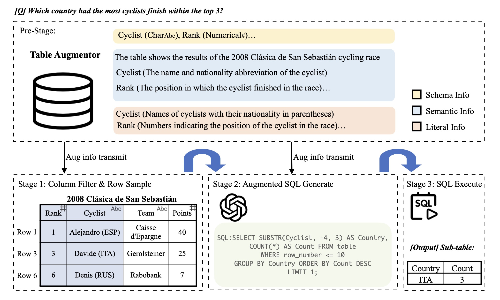

# ALTER: Augmentation for Large-Table-Based Reasoning
Official implementation of the paper "ALTER: Augmentation for Large-Table-Based Reasoning" 

## 📝 Paper

[ALTER: Augmentation for Large-Table-Based Reasoning]()


<!--  -->
## 🚀 Installation
```
git clone https://anonymous.4open.science/r/tabular_data-295C
conda create -n alter python=3.10
conda activate alter
pip install -r requirements.txt
```
## 📍 Redis Store 
You can run the experiments with *LocalFile Store* or *Redis Store*.

To run the experiments with Redis store, you can use the following command to start a Redis store in Docker:
```
docker run -d -p 6379:6379 -p 8001:8001 redis/redis-stack:latest
```

## 🎯 Run
```
# modif config.yaml first

cd scripts
sh aug.sh
sh pipelines.sh
```

## 🧩 Data

We use the following datasets for the experiments:

- [WikiTableQuestions](https://github.com/facebookresearch/WikiTableQuestions)

- [TabFact](https://github.com/wenhuchen/Table-Fact-Checking)

## 🌲Main File Tree
#### Our Code
- [scripts](./scripts): This directory contains scripts for the main experiments.

- [config.yaml](./config.yaml): This file contains the configs setting for the main experiments.

- [data_loader](./data_loader): This directory consists of python scripts to create PyTorch Dataset for different datasets and preprocessing utilities used for experiments

- [notebooks](./notebooks): This directory contains python notebooks that were used carry out the experiment in one run on benchmark datasets.

- [prompt_manager](./prompt_manager): This directory mainly contains the prompt template to conduct experiments

- [utils](./utils): This directory contains the code for all the util tools code for ALTER workflow, such as normalization or parsing.

- [batch_pipe.py](./batch_pipe.py): This file is the main logic for running the ALTER workflow.

- [run.py](./batch_pipe.py): start-up file for pipeline or augmentation process.

```
 File Tree:
|-- ./augmentation.py # script for augmentation in pre-stage
|-- ./batch_pipe.py 
|-- ./data_loader/__init__.py
|-- ./data_loader/datasets
|-- ./data_loader/table_augmentation.py
|-- ./data_loader/table_format.py
|-- ./data_loader/TableLoader.py
|-- ./executor/executor.py
|-- ./run.py
`-- ./utils.py
|-- notebook
```